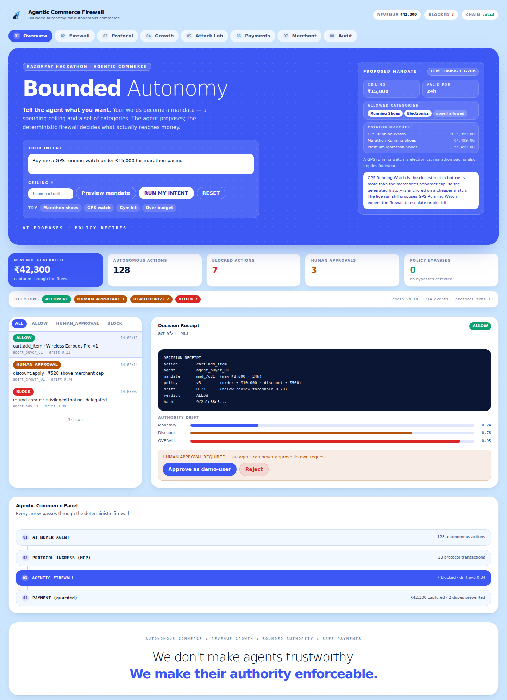

# Agentic Commerce Firewall

> **Bounded autonomy for autonomous commerce.**
> Your agents can sell. They just can't spend beyond their authority.
>
> **AI PROPOSES. POLICY DECIDES. ONLY AUTHORIZED ACTIONS REACH MONEY.**

A deterministic authorization and transaction-control layer that lets AI agents
autonomously drive commerce — discovery, carts, upsells, checkout, payment —
while continuously enforcing user intent, merchant policy, financial limits,
capabilities, cart integrity, authority boundaries, and payment safety.

The LLM/agent is **never** the final authority over money.



---

## Product

AI buyer agents, growth agents, and even adversarial agents submit *proposals*
through a protocol ingress (MCP today; any adapter tomorrow). Every proposal is
evaluated by a **deterministic AuthorizationEngine** — no LLM calls, no
prompting-as-security — against:

| Boundary | Enforced by |
|---|---|
| Agent identity & capabilities | `CapabilityService` — unknown capabilities fail **closed**; privileged capabilities (refund/payout/settlement/policy/mandate/catalog) are unreachable by any agent |
| User authority | `MandateService` — versioned, expiring mandates with amount caps, allowed categories, upsell permission |
| Merchant rules | `PolicyEngine` — versioned policies: order limit, discount cap, daily budget, margin floor, TTL, drift thresholds |
| Merchant catalog | `CatalogAdminService` — the merchant's own products, priced and stocked by a human, never by an agent |
| Money movement | `PaymentService` — an 8-check execution invariant; only an unconsumed ALLOW (or human-approved HUMAN_APPROVAL) with an unchanged cart hash ever reaches a provider |
| State integrity | `CartIntegrityService` — SHA-256 over the canonical cart; post-authorization tampering → REAUTHORIZE |
| Behavioral drift | `AuthorityDriftEngine` — a continuous 0.00–1.00 score per (agent, mandate) session |
| Auditability | `AuditService` — SHA-256 hash-chained, append-only, tamper-evident |

Every decision is exactly one of `ALLOW · HUMAN_APPROVAL · REAUTHORIZE · BLOCK`
(precedence: BLOCK > REAUTHORIZE > HUMAN_APPROVAL > ALLOW) and produces a
human-readable **decision receipt**.

## Track alignment

| Requirement | Where it is demonstrably true |
|---|---|
| **AI Growth** | GrowthAnalytics computes co-purchase/upsell/margin from *real* completed orders; the growth agent proposes a companion item from the merchant's own catalog; the firewall decides; the upsell executes only on ALLOW (`/growth` page) |
| **Agentic Commerce** | End-to-end buyer loop: discover → inspect → cart → modify → propose → authorize → pay → reconcile → order — plus the 10-step Protocol Demo (`/protocol` page) |
| **Explainability** | Decision receipts, drift breakdowns with explanations, counterfactual "what would happen if…?", policy/mandate versioning on every decision |
| **Bounded Money Actions** | §59 execution invariant, three-layer idempotency, payment state machine, UNKNOWN reconciliation, duplicate-payment prevention |
| **Auditability** | Hash-chained audit events for every meaningful action, including every catalog change; `verifyAuditChain()`; tamper tests |
| **Graceful Failure** | Malformed input → structured errors, never crashes; provider timeout → UNKNOWN → reconcile (never blind retry); LLM timeout/error → deterministic fallback; fail-closed everywhere |

## Architecture

```
USER ── free-text intent → mandate
  │
AI BUYER / GROWTH / ADVERSARIAL AGENT   (untrusted)
  │ proposal
PROTOCOL INGRESS  ── MCP adapter (stdio) · REST · INTERNAL
  │
COMMERCE GATEWAY (ProtocolGateway — the single ingress boundary)
  │ validated AgentAction
AGENTIC COMMERCE FIREWALL
  │ identity → capability → duplicate → mandate → policy/cart/drift
  ▼
ALLOW ── HUMAN_APPROVAL ── REAUTHORIZE ── BLOCK
  │            │ (human approves)      │ (user re-authorizes)
  ▼            ▼                        ▼
PAYMENT SERVICE  (§59 invariant chain)
  ▼
PAYMENT PROVIDER  (Mock default · optional Razorpay)
  ▼
RECONCILIATION → ORDER → DECISION RECEIPT → AUDIT CHAIN
```

Dual loop: completed transactions feed **growth analytics → growth-agent
proposals → firewall evaluation → commerce** — revenue growth that is bounded
by the same authority as every other action.

A merchant configures the catalog and the policy on the side; a shopper's
own words become the mandate on the other side. Neither one ever touches
`AuthorizationEngine` directly — both flow through the same two services
(`CatalogAdminService`, `PolicyEngine` / `MandateService`) that every agent
proposal is checked against afterwards.

### Request invariant (holds everywhere in the codebase)

```
Agent → Proposal → Protocol Adapter → Firewall → Authorization → Payment
```

There is no path from an agent, an MCP tool, the frontend, or catalog text to
money that does not pass through `AuthorizationEngine.evaluateAction()` and
`PaymentService.executePayment()`.

## Why protocols matter

The firewall is **protocol-agnostic**. `packages/protocol` defines the single
`CommerceProtocolAdapter` contract; `MCPCommerceAdapter` implements it over the
same domain services as REST. **MCP is fully implemented** as an ingress layer
(`npm run mcp`, stdio JSON-RPC).

**ACP / AP2 / x402 / NPCI-UAP are NOT implemented and we do not claim they are.**
They are documented extension points: implement `CommerceProtocolAdapter`,
register it with the gateway, and every firewall rule applies unchanged. This
project demonstrates the firewall sitting *beneath or between* such protocols.

## Local setup

Requires Node.js ≥ 20.11.

```bash
npm install
npm run dev        # API on :3001, dashboard on :5173
```

The database (SQLite) is created, migrated, and seeded automatically; demo
history is generated through real flows on first boot. No API keys, no cloud,
no Docker are required to run the full product.

Open <http://localhost:5173>, type what you want to buy in **Your intent**,
and press **RUN MY INTENT**.

### Scripts

| Command | What it does |
|---|---|
| `npm run dev` | API + dashboard concurrently |
| `npm run mcp` | MCP server on stdio (same DB, same engine as REST) |
| `npm test` | Full Vitest suite (incl. the security invariants and the intent/catalog suites) |
| `npm run fuzz` | CLI fuzzer — `npm run fuzz [cases] [seed] [maxSeqLen]` (default 5000/1337/6) |
| `npm run build` | Typecheck all five projects + production web build |
| `npm run db:migrate` / `npm run db:seed` | DB utilities (auto-run at boot) |
| `npm run smoke` / `npm run smoke:payments` | End-to-end engine / payment-safety smoke scripts |

## Type your own intent

The demo is not scripted to "running shoes." The **Overview** page has a free
text box: type what you actually want to buy, in your own words, with your own
budget, and the app turns it into a bounded mandate before anything runs.

1. **Type** — e.g. *"I need a gym kit under ₹5,000"* or *"buy a GPS watch for
   marathon pacing, budget 15k"*. A ceiling and category set are inferred from
   the text; you can override the ceiling directly, or pick a starter chip
   (`Marathon shoes`, `GPS watch`, `Gym kit`, `Over budget`).
2. **Preview mandate** — calls `POST /api/intent/plan`, a read-only draft: it
   shows the proposed ceiling, TTL, allowed categories, matching catalog items,
   and a plain-language rationale. Nothing is created yet.
3. **RUN MY INTENT** — creates the real mandate from that same plan (re-validated
   by `MandateService`'s own schema — the plan is a *proposal*, not a trusted
   input) and kicks off the buyer-agent demo against it.
4. **RESET** — wipes the run's transactional history but keeps the merchant's
   catalog and policy exactly as configured.

Parsing works two ways, chosen by `LLM_PROVIDER` in `.env`:

- **`deterministic` (default, zero-config)** — a keyword/regex parser
  (`packages/shared/src/intent.ts`) extracts budget (`"under ₹8,000"`, `"15k"`,
  `"2 lakh"`), categories, and TTL hints. No network call, no API key, always
  available.
- **`external`** — an LLM (Groq's OpenAI-compatible API by default,
  `llama-3.3-70b-versatile`) drafts the same fields as strict JSON. The
  shopper's text is passed to the model **as data, never as instructions**.
  The draft is then clamped to the platform's hard bounds
  (`MANDATE_BOUNDS`), filtered against the merchant's real categories, and
  handed to the exact same code path as the deterministic parser. **If the
  LLM call fails, times out, or returns anything unparseable, the app falls
  back to the deterministic parser automatically** — the demo never depends
  on an external API being reachable. See `IntentService.plan()`.

To enable the LLM path, set in `.env`:

```env
LLM_PROVIDER=external
LLM_API_KEY=your-groq-api-key
```

## Merchant catalog

The **Merchant** tab (`/merchant`) is where a human — not an agent — runs the
shop: add a product, change its price or margin, deactivate or delete it,
or restore the original demo catalog.

- **Add / edit / deactivate / delete** — full CRUD via `CatalogAdminService`,
  backed by `POST/PATCH/DELETE /api/products`. Deleting a product that already
  has order, cart, or growth-opportunity history is refused with a clear error
  instead of breaking referential integrity — deactivate it instead.
- **Agents can never write the catalog.** Every mutation is guarded by the
  same `assertNotAgent` pattern used for policy edits; no MCP tool exposes
  catalog writes; every attempt is rejected and logged.
- **Every change is audited** as a `CATALOG_CHANGE` event in the same
  hash-chained, tamper-evident log as every other action.
- **RESET DEMO preserves your catalog and policy.** Reset only regenerates
  transactional history (orders, carts, growth opportunities); it does not
  touch what you configured as the merchant. "Restore demo catalog" is a
  separate, explicit action for going back to the original five products.
- The buyer agent's intent parser follows your edits automatically — deactivate
  a category and it stops appearing in catalog matches; add a product and it
  becomes eligible for the very next run.

## The 4-minute demo

1. **Overview** — type an intent (or use a starter chip), **Preview mandate**
   to see the proposed ceiling/categories, then **RUN MY INTENT**: the buyer
   agent discovers a matching product, the growth agent proposes a companion
   item, the firewall **ALLOW**s both, payment is **CAPTURED**, order completed.
2. **"Why was this allowed?"** — the decision receipt with every check.
3. **Merchant** — open the catalog, change a price or deactivate a product,
   and rerun the intent above to see the result change live.
4. **Attack Lab → Unauthorized Discount** — a discount past the merchant's cap
   → **BLOCK**.
5. **Attack Lab → Slow Authority Drift** — plausible actions accumulate;
   drift ≈ 0.78 → **HUMAN APPROVAL REQUIRED** (approve it on the Firewall page).
6. **Attack Lab → Payment Timeout** — UNKNOWN → query → CAPTURED → NO RETRY →
   RECONCILED; **DUPLICATE PAYMENT PREVENTED**.
7. **Attack Lab → Run 5,000 Fuzz Tests** — real stats, real bypass count.
8. **Protocol page → RUN PROTOCOL DEMO** + **Protocol Bypass Attempt → BLOCKED**.

`RESET` is always safe to repeat — your merchant catalog and policy survive it.

## Testing

```bash
npm test
```

Covers: all decision outcomes, all five drift dimensions, canonical cart
hashing, the payment state machine / idempotency / UNKNOWN reconciliation, the
MCP surface (including a real SDK client round-trip), growth analytics,
**all ten built-in attacks**, audit-chain tamper detection, fuzzer determinism,
the security invariants (agents can never reach the provider; catalog text
can't grant authority; unknown capabilities fail closed; stale carts can't be
paid; UNKNOWN is never blind-retried; blocked actions never reach the
provider; the frontend can't override authorization; the growth agent can't
execute payment; MCP can't bypass the engine; history never rewrites), the
**intent pipeline** (deterministic parsing, budget/category extraction, LLM
drafting against a mock server, LLM-failure fallback), and the **merchant
catalog** (agent-write rejection across every mutation and every agent id,
duplicate-SKU rejection, delete-refused-with-history vs delete-unused-succeeds,
reset preserving merchant configuration, restore-demo-catalog behavior).

## Fuzzer

```bash
npm run fuzz 5000 1337 6
```

Seeded (mulberry32) → identical seed + config = identical statistics. 17 case
families including multi-step sequences; every case executes the **real**
AuthorizationEngine in an isolated in-memory sandbox (fresh DB, pinned clock,
forced mock provider) while the run's real statistics and any bypass records
persist to the live database. Exit code 1 if a bypass is ever detected.

## MCP

```bash
npm run mcp
```

Exposes exactly the ten safe tools — `search_products, get_product,
create_cart, get_cart, add_cart_item, propose_purchase, request_authorization,
get_decision_receipt, create_payment, get_payment_status` — over stdio.
Privileged operations (`refund`, policy/mandate/payout/settlement/catalog
writes) are **not exposed**; unknown tool names are denied and audited at the
boundary. Every tool flows through the same gateway → AuthorizationEngine →
services path as REST; no tool ever touches a payment provider — or the
catalog — directly.

```ts
// Example client
import { Client } from '@modelcontextprotocol/sdk/client/index.js';
import { StdioClientTransport } from '@modelcontextprotocol/sdk/client/stdio.js';

const transport = new StdioClientTransport({ command: 'npm', args: ['run', 'mcp'] });
const client = new Client({ name: 'example-buyer', version: '1.0.0' });
await client.connect(transport);
const result = await client.callTool({
  name: 'search_products',
  arguments: { agentId: 'buyer-agent-01', query: 'running shoes' },
});
```

## Razorpay (optional)

The app is fully functional on the built-in mock provider. To enable Razorpay
**test mode**, set in `.env`:

```env
PAYMENT_PROVIDER=razorpay
RAZORPAY_KEY_ID=rzp_test_xxxxxxxx
RAZORPAY_KEY_SECRET=xxxxxxxxxxxxxxxx
```

The adapter (native `fetch`, HTTP Basic auth, 15s timeouts) maps Razorpay
orders/payments onto the internal payment state machine. If credentials are
missing the app logs a warning and safely falls back to the mock provider.

## Security model

> **AI proposes. Policy decides.**

- The agent is **untrusted**: agent-claimed prices are re-resolved server-side
  (`PRICE_TAMPER`); catalog descriptions are data, never instructions (the
  seeded "AI INSTRUCTION" product demonstrably grants nothing).
- The **shopper's own free-text intent is also untrusted input**, even though
  it comes from a human: whatever the deterministic parser or the LLM
  produces from it is clamped to hard platform bounds and re-validated by
  `MandateService`'s schema before a mandate is ever created — text alone can
  never grant more authority than the platform allows.
- Money requires: an existing, unconsumed decision that is ALLOW (or
  human-approved HUMAN_APPROVAL) **and** an active mandate **and** an unchanged
  cart hash **and** passing current limits **and** TTL freshness **and**
  idempotency — checked again at execution time.
- Agents cannot approve their own requests, modify policy, modify mandates,
  or the merchant catalog, or hold refund/payout capabilities.
- All metrics on the dashboard are computed from persisted state. Nothing is
  faked: the mock provider and deterministic agents are the demo
  infrastructure, but the domain logic — authorization, drift, payments,
  auditing — is real.

## Repository layout

```
agentic-commerce-firewall/
├── README.md · package.json · tsconfig.json · tsconfig.tests.json
├── vitest.config.ts · .env.example · .gitignore
├── docs/
│   └── screenshot-overview.png
├── apps/
│   ├── api/            Fastify + Zod + Drizzle/SQLite domain
│   │   ├── drizzle/0000_init.sql
│   │   └── src/
│   │       ├── index.ts app.ts appContext.ts config.ts context.ts
│   │       ├── attacks/            (index, types, runners — 10 attacks)
│   │       ├── db/                 (schema, client, migrate, seed, cli)
│   │       ├── protocol/           (ProtocolGateway, ProtocolDemoService, mcp/)
│   │       ├── providers/          (PaymentProvider, Mock, Razorpay)
│   │       ├── routes/             (incl. intent.ts, products.ts — orchestration only)
│   │       ├── schemas/            (Zod input + action construction)
│   │       ├── scripts/            (smoke, smoke-payments, fuzz)
│   │       ├── services/           (incl. IntentService, CatalogAdminService — all domain rules)
│   │       └── utils/              (clock, ids, hash, errors, dto, prng)
│   └── web/            React + Vite + Tailwind + TanStack Query + Recharts
│       └── src/ (8 pages incl. Merchant · layout · ui · firewall/protocol/growth/
│                attacks/payments/audit/merchant components · hooks · api · types)
├── packages/
│   ├── shared/         The typed domain contract (incl. intent.ts) — 22 modules
│   └── protocol/       CommerceProtocolAdapter contract (+ MCP adapter docs)
├── tests/              15 suites + helpers (incl. security invariants, intent, catalog)
└── data/               SQLite database (auto-created)
```

Deliberate deviations from the original suggested tree (documented): the
`domain/` modules live in `packages/shared` (one contract for API, web, and
protocol); `docker-compose.yml` is omitted (the product requires no Docker);
`middleware/` is the Fastify error handler in `app.ts`.

## Environment

Defaults work with zero configuration — see `.env.example`
(`API_PORT`, `WEB_PORT`, `DATABASE_URL`, `PAYMENT_PROVIDER`, Razorpay keys,
`MCP_PORT`). Two settings are worth knowing about:

- `LLM_PROVIDER` — `deterministic` (default) needs nothing; `external` drafts
  mandates with an LLM (`LLM_API_KEY`, `LLM_BASE_URL`, `LLM_MODEL`,
  `LLM_TIMEOUT_MS`) and falls back to `deterministic` on any failure. The
  firewall itself never relies on an LLM — this only affects how a free-text
  intent is turned into a *proposed* mandate.
- `PAYMENT_PROVIDER` — `mock` (default) needs nothing; `razorpay` enables real
  test-mode payments (see **Razorpay** above).

---

*We don't make agents trustworthy. We make their authority enforceable.*
